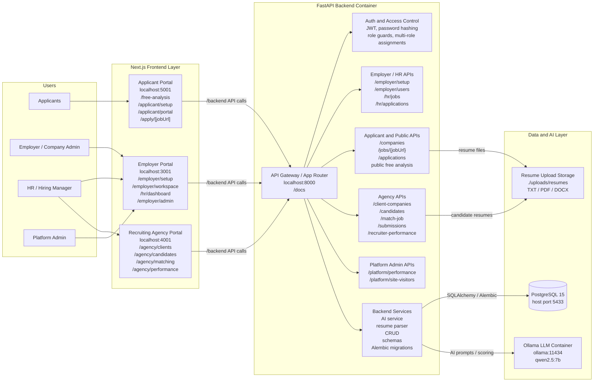
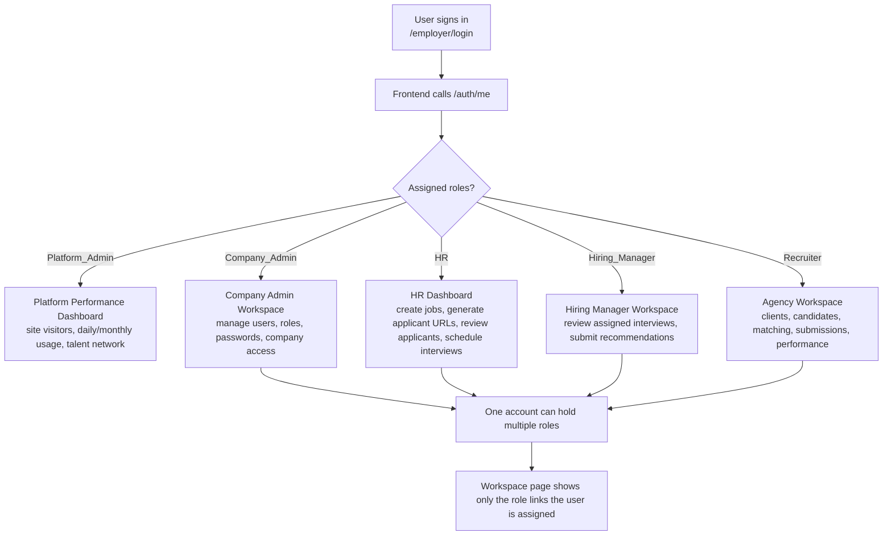
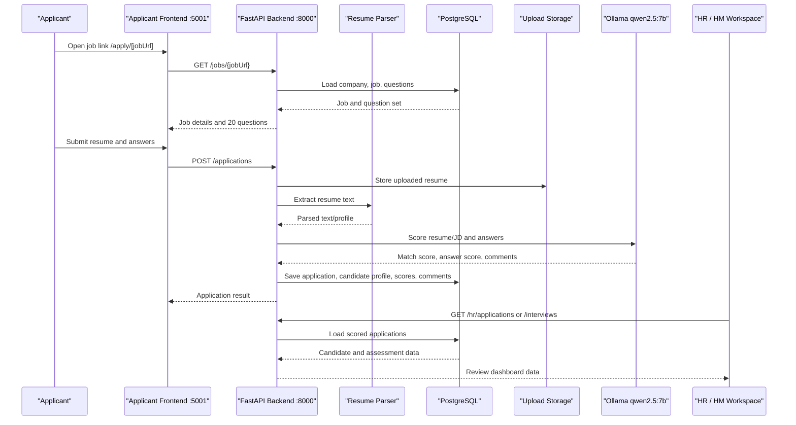
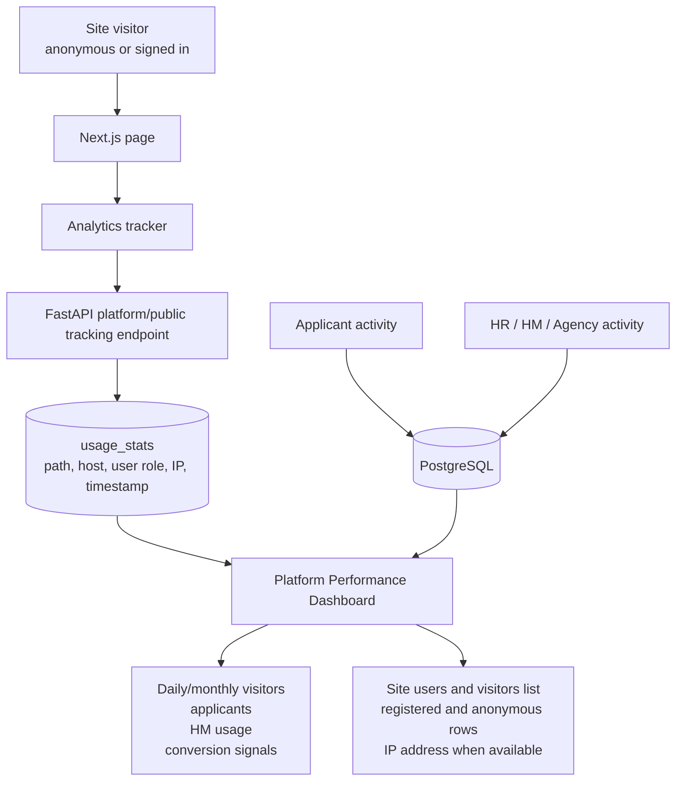

# Recruit-System Mermaid Diagrams

## System Architecture

```mermaid
flowchart LR
  subgraph Users
    Applicant[Applicants]
    Employer[Employer / Company Admin]
    HRHM[HR / Hiring Manager]
    PlatformAdmin[Platform Admin]
  end

  subgraph Frontend["Next.js Frontend Layer"]
    FE3001["Employer Portal<br/>localhost:3001<br/>/employer/setup<br/>/employer/workspace<br/>/hr/dashboard<br/>/employer/admin"]
    FE4001["Recruiting Agency Portal<br/>localhost:4001<br/>/agency/clients<br/>/agency/candidates<br/>/agency/matching<br/>/agency/performance"]
    FE5001["Applicant Portal<br/>localhost:5001<br/>/free-analysis<br/>/applicant/setup<br/>/applicant/portal<br/>/apply/[jobUrl]"]
  end

  subgraph Backend["FastAPI Backend Container"]
    API["API Gateway / App Router<br/>localhost:8000<br/>/docs"]
    Auth["Auth and Access Control<br/>JWT, password hashing<br/>role guards, multi-role assignments"]
    EmployerAPI["Employer / HR APIs<br/>/employer/setup<br/>/employer/users<br/>/hr/jobs<br/>/hr/applications"]
    ApplicantAPI["Applicant and Public APIs<br/>/companies<br/>/jobs/{jobUrl}<br/>/applications<br/>public free analysis"]
    AgencyAPI["Agency APIs<br/>/client-companies<br/>/candidates<br/>/match-job<br/>/submissions<br/>/recruiter-performance"]
    PlatformAPI["Platform Admin APIs<br/>/platform/performance<br/>/platform/site-visitors"]
    Services["Backend Services<br/>AI service<br/>resume parser<br/>CRUD<br/>schemas<br/>Alembic migrations"]
  end

  subgraph DataAI["Data and AI Layer"]
    DB[("PostgreSQL 15<br/>host port 5433")]
    Uploads["Resume Upload Storage<br/>./uploads/resumes<br/>TXT / PDF / DOCX"]
    Ollama["Ollama LLM Container<br/>ollama:11434<br/>qwen2.5:7b"]
  end

  Applicant --> FE5001
  Employer --> FE3001
  HRHM --> FE3001
  HRHM --> FE4001
  PlatformAdmin --> FE3001

  FE3001 -->|/backend API calls| API
  FE4001 -->|/backend API calls| API
  FE5001 -->|/backend API calls| API

  API --> Auth
  API --> EmployerAPI
  API --> ApplicantAPI
  API --> AgencyAPI
  API --> PlatformAPI
  API --> Services

  Services -->|SQLAlchemy / Alembic| DB
  ApplicantAPI -->|resume files| Uploads
  AgencyAPI -->|candidate resumes| Uploads
  Services -->|AI prompts / scoring| Ollama
```

## Role-Based Workspace Flow

```mermaid
flowchart TD
  Start["User signs in<br/>/employer/login"] --> Me["Frontend calls /auth/me"]
  Me --> Roles{"Assigned roles?"}

  Roles -->|Platform_Admin| Platform["Platform Performance Dashboard<br/>site visitors, daily/monthly usage, talent network"]
  Roles -->|Company_Admin| Admin["Company Admin Workspace<br/>manage users, roles, passwords, company access"]
  Roles -->|HR| HR["HR Dashboard<br/>create jobs, generate applicant URLs, review applicants, schedule interviews"]
  Roles -->|Hiring_Manager| HM["Hiring Manager Workspace<br/>review assigned interviews, submit recommendations"]
  Roles -->|Recruiter| Recruiter["Agency Workspace<br/>clients, candidates, matching, submissions, performance"]

  Admin --> MultiRole["One account can hold multiple roles"]
  HR --> MultiRole
  HM --> MultiRole
  Recruiter --> MultiRole
  MultiRole --> Switch["Workspace page shows only the role links the user is assigned"]
```

## Auto Mediator Hiring Workflow

```mermaid
flowchart LR
  Setup["1. Company / Agency Setup<br/>First admin gets Company Admin + HR + Hiring Manager"]
  Job["2. Create Job<br/>JD, title, position, salary range"]
  Questions["3. Generate Questions<br/>10 hard skill + 10 soft skill"]
  Link["4. Publish Job URL<br/>company board or direct apply link"]
  Applicant["5. Applicant Applies<br/>account, resume upload, answers"]
  Score["6. AI Assessment<br/>resume/JD score, answer score, comments"]
  Review["7. HR Review<br/>qualify, reject, schedule"]
  Interview["8. HM Interview Review<br/>recommendation and notes"]
  Decision["9. Final Outcome<br/>hired, rejected, pending, agency feedback"]

  Setup --> Job --> Questions --> Link --> Applicant --> Score --> Review --> Interview --> Decision
```

## Applicant Data and AI Scoring Flow

```mermaid
sequenceDiagram
  participant A as "Applicant"
  participant FE as "Applicant Frontend :5001"
  participant API as "FastAPI Backend :8000"
  participant Parser as "Resume Parser"
  participant DB as "PostgreSQL"
  participant Files as "Upload Storage"
  participant LLM as "Ollama qwen2.5:7b"
  participant HR as "HR / HM Workspace"

  A->>FE: Open job link /apply/[jobUrl]
  FE->>API: GET /jobs/{jobUrl}
  API->>DB: Load company, job, questions
  DB-->>API: Job and question set
  API-->>FE: Job details and 20 questions

  A->>FE: Submit resume and answers
  FE->>API: POST /applications
  API->>Files: Store uploaded resume
  API->>Parser: Extract resume text
  Parser-->>API: Parsed text/profile
  API->>LLM: Score resume/JD and answers
  LLM-->>API: Match score, answer score, comments
  API->>DB: Save application, candidate profile, scores, comments
  API-->>FE: Application result

  HR->>API: GET /hr/applications or /interviews
  API->>DB: Load scored applications
  DB-->>API: Candidate and assessment data
  API-->>HR: Review dashboard data
```

## Platform Analytics Flow

```mermaid
flowchart TD
  Visitor["Site visitor<br/>anonymous or signed in"] --> Frontend["Next.js page"]
  Frontend --> Tracker["Analytics tracker"]
  Tracker --> API["FastAPI platform/public tracking endpoint"]
  API --> UsageStats[("usage_stats<br/>path, host, user role, IP, timestamp")]

  ApplicantUse["Applicant activity"] --> DB[("PostgreSQL")]
  EmployerUse["HR / HM / Agency activity"] --> DB
  UsageStats --> Dashboard["Platform Performance Dashboard"]
  DB --> Dashboard

  Dashboard --> Cards["Daily/monthly visitors<br/>applicants<br/>HM usage<br/>conversion signals"]
  Dashboard --> List["Site users and visitors list<br/>registered and anonymous rows<br/>IP address when available"]
```
